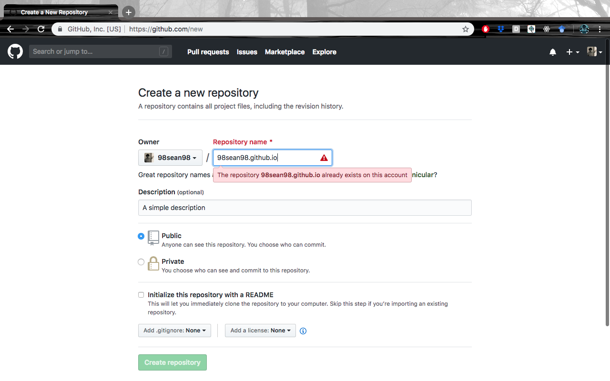

# Gatsby-React-GraphQL Template for Building a Personal CV

This is a github repository to help you build your a simple online CV using [Gatsby](https://www.gatsbyjs.org/), [React](https://reactjs.org/) and [GraphQL](https://graphql.org/).
Here, you will be guided to build your personal CV, and host it on [github pages](https://pages.github.com/).
It is recommended for you to know the basics of [Javascript](https://javascript.info/) before continuing this tutorial. Also, you need to know about the [command line](https://www.davidbaumgold.com/tutorials/command-line/), [git and github](https://codeburst.io/git-and-github-in-a-nutshell-b0a3cc06458f), as well as a package manager called [npm](https://www.npmjs.com/).

*Don't worry if you don't know any of these things here, there will be installation guides and quickstarts embedded in this tutorial, you just have to click those links. It will be a great learning experience for you.*

**We will use a unix-based terminal such as the one on Linux OS or macOS. Windows users, we're sorry, it's just much harder (and annoying) to use windows command prompts. So, try to figure out a way to use Linux, or borrow a friend's MacBook.**

### Getting Started - Installing Stuff
First, you need a few extra things on your computer. Install
1. [git](https://www.atlassian.com/git/tutorials/install-git)
2. [npm](https://www.npmjs.com/get-npm)

**If you have installed these things, you may continue directly.**

#### Now, let's really get started.
First, fire up the Terminal. Go to a directory that you might want to place this website's files into. Then, clone this repository onto your own computer.
```
git clone https://github.com/rcltech/gatsby_cv_template.git [your directory]
```
*Replace* `[your directory]` *with any directory name you like (without the square brackets* `[ ]` *). Also, in the future, whenever you see* `[something]` *, this means, you should replace it with something that you personally own, or about yourself.*

Then, go into that directory.
```
cd [your directory]
```

Based on `src` files, `gatsby-config.js` and other source files, Gatsby uses npm packages to quickly build websites into a `public` directory. For now, you will not see a `public` directory yet, because you haven't called the relevant command to build. For now, you need to install the required npm packages by running the following command.
```
npm install
```
So, npm installs packages from the internet based on dependencies listed in `package.json`. You can open and take a look at this file to see what kind of things Gatsby is using.

You also need [gatsby-cli](https://www.npmjs.com/package/gatsby-cli) to develop and build the actual website, and [gh-pages](https://www.npmjs.com/package/gh-pages) to bring the `public` directory to your github repository that will eventually host the website.
```
npm install -g gatsby-cli gh-pages
```
*If this npm install gives an error like 'permission denied', try* `sudo npm install -g gatsby-cli gh-pages` *instead. You will be asked your computer's user password.*

Next, you should test if all of the packages have been installed properly, by testing if they work as intended.
```
gatsby develop
```
Your terminal starts hosting the website locally, on your computer.


Open a web browser like google chrome, and enter the url `localhost:8000` to checkout the website template.

### Writing Your CV ###
It is fine if you're not interested in learning React, the fundamental Javascript library that powers Gatsby. All of the information that will be displayed on the website is stored in `data/siteConfig.js`. That means, you only have to make changes to this file, and the website's content will be changed accordingly. However, it is not possible to change the design layout without digging into `src/components`.

**For the purpose of simplicity, we will not go into React.**

Now, you just have to configure `data/siteConfig.js` to display the content you want, which is your CV. So, open the file using a text editor.

You will see something like this.
```
module.exports = {
  [information]
}
```
This file contains some comments, and you just have to follow those comments and put in relevant information. How simple is that!

Next, make sure you save the file. And you can take a look at what you have built so far.
```
gatsby develop
```
*Also, remove those comments when you're done.*

### Configuring Other Files
You need to modify files other than `data/siteConfig.js` to ensure that other parts of the website, such as the website title, are tailored for you. Make sure that you modify these files according to the comments written inside each file:
1. `gatsby-config.js`
2. `src/html.js`

### Pictures pictures pictures
Next, you should change profile pictures and logos.

**It is recommended to use square-shaped photos, with as little writing as possible.**

Place all of your pictures / logos into the `static` directory. Properly name them; for example, use `profile_pic.jpeg` instead of `profile pic.jpeg`. Knowing the type of picture is also very important.

Use your pictures in `data/siteConfig.js`, and `gatsby-config.js`. Follow the comments in those files.

Now, before we move on, let's check if everything has been done right.
```
gatsby develop
```
Check your browser with the url `localhost:8000`.

Satisfied with what you have?


### Push and Host!
Now, you need a Github account. Go [make](https://github.com/) one if you don't have it already.

Create a new repository `[your username]/[your username].github.io`. You will store the website files here, then Github will use it to host the website on the internet.



As I already have a repository for my cv, there's a warning if I try to create another one with that same repository name. In your case, you should only look at how I name that repository.

Go back to the Terminal. Now, you need to tell Gatsby to build a proper website into the `public` directory.
```
gatsby build
```
This building process will take a while. Once, you're done, you could push this directory onto github. **We are not using** `git push` **here because it is not required to push the entire** `gatsby_cv_template` onto `[your username].github.io` **. We only need to move** `public` **directory using** `gh-pages` **.**

Copy your github repository url, under *Clone or Download* (in green colour).


```
gh-pages -d public/ -r [your github repository url] -b master
```
Example:
```
gh-pages -d public/ -r https://github.com/98sean98/98sean98.github.io.git -b master
```


#### Now, enjoy your website. Go to `[your username].github.io` on your web browser.

### Credits:
* [Utkarsh Goel](http://ugoel.me/) - Designer of this Gatsby CV Template
* [Sean Chok](https://98sean98.github.io/) - Author of this Documentation / Tutorial

#### Also try to challenge yourself by learning Gatsby, React and GraphQL, the three technologies powering your website.
